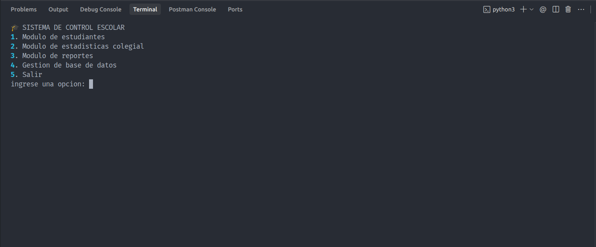
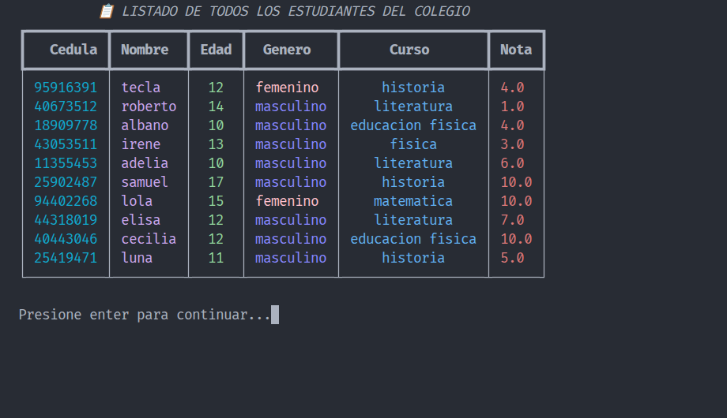
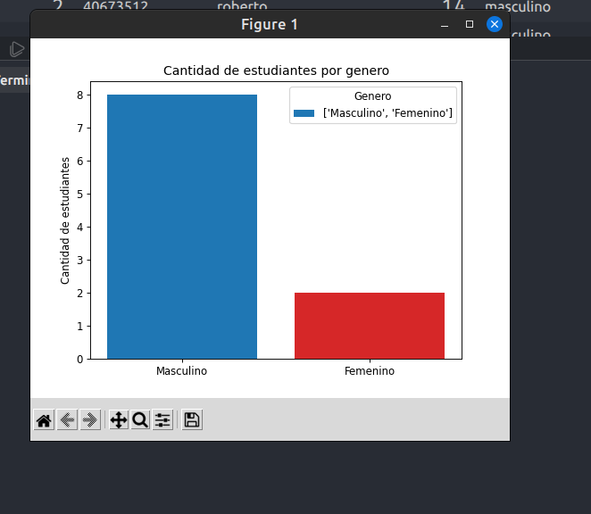
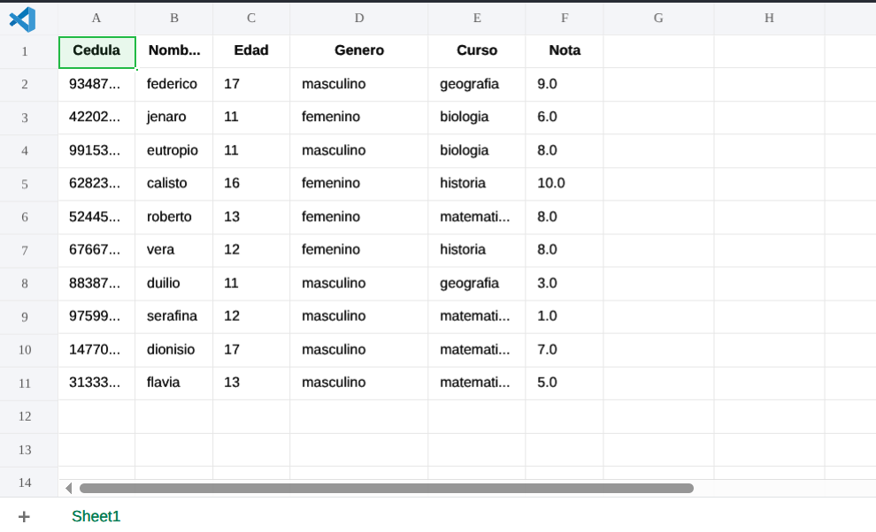

# Sistema de Gestión y Análisis Estadístico Estudiantil 📊🐍

Este es un sistema robusto de gestión académica desarrollado en **Python**, diseñado bajo estándares de ingeniería de software para automatizar el control de registros, notas y estadísticas escolares. El proyecto utiliza una arquitectura **MVC (Modelo-Vista-Controlador)** para garantizar la escalabilidad y el mantenimiento del código.

## 🚀 Características Principales

- **Arquitectura Profesional:** Implementación del patrón de diseño MVC para una separación clara de responsabilidades.
- **Persistencia de Datos:** Gestión eficiente de información mediante **SQLite**, con creación automática de tablas y manejo de consultas relacionales.
- **Lógica de Negocio Avanzada:** Uso de **Programación Orientada a Objetos (POO)** con herencia múltiple para una estructura de clases eficiente (Persona -> Estudiante).
- **Análisis Estadístico:** Generación de reportes automáticos sobre el rendimiento académico de los estudiantes.
- **Interfaz Elegante:** Uso de la librería `Rich` para una experiencia de usuario superior en la consola (tablas, colores y formato).

## 🛠️ Tecnologías Utilizadas

- **Lenguaje:** Python 3.x
- **Base de Datos:** SQLite
- **Librerías:** - `sqlite3` (Persistencia)
  - `rich` (Interfaz de usuario y formato)
- **Control de Versiones:** Git & GitHub

## 📂 Estructura del Proyecto

```text
├── app/
│   ├── Controllers/    # Lógica de negocio (Persona, Estudiante, Estadísticas)
│   ├── Models/         # Interacción con la base de datos (SQLite tables)
│   ├── Views/          # Interfaz de usuario y menús
│   └── package/        # Módulos transversales (Validaciones)
├── main.py             # Punto de entrada de la aplicación
├── requirements.txt    # Dependencias del proyecto
```

## ⚙️ Instalación y Uso

1. Clonar el repositorio: git clone [https://github.com/halmage/student-stats-python.git](https://github.com/halmage/student-stats-python.git)
2. Instalar dependencias: pip install -r requirements.txt
3. Ejecutar la aplicación: python main.py

## 📸 Vista Previa del Sistema

A continuación se detallan las funcionalidades principales del sistema a través de su interfaz de consola enriquecida:

### 1. Menú Principal y Navegación



- **Descripción:** Interfaz de inicio diseñada con la librería `Rich`. Presenta un menú interactivo y organizado por colores que permite al usuario navegar fácilmente entre la gestión de alumnos, visualización de estadísticas, generación de reportes y administración de la base de datos SQLite.

### 2. Gestión y Listado de Estudiantes



- **Descripción:** Visualización de la persistencia de datos en tiempo real. Se muestra una tabla formateada con bordes y estilos profesionales donde se listan los datos: Cedula, Nombre, Edad, Genero Curso y Nota recuperados directamente desde la base de datos `colegio.db`.

### 3. Panel de Análisis Estadístico



- **Descripción:** Módulo que muestra de forma visual la cantidad de alumnos por su genero, demostrando la capacidad del sistema para procesar lógica de negocio.

### 4. Generación de Reportes CSV



- **Descripción:** Demostración de la capacidad de exportación del sistema. Se observa el proceso de creación de archivos físicos en la ruta `app/assets/reports/`, permitiendo que la información académica sea procesada externamente en herramientas como Excel.

## 🛡️ Mejores Prácticas Aplicadas

- **Clean Code:** Código documentado con _Docstrings_ y siguiendo convenciones de nombrado claras.
- **Manejo de Excepciones:** Implementación de bloques `try-except` para prevenir cierres inesperados y gestionar errores de usuario.
- **Modularización:** Proyecto dividido en paquetes y módulos para facilitar la colaboración y el testeo.

**Desarrollado por [Hugo Zorrilla](https://www.google.com/search?q=https://www.linkedin.com/in/hugo-zorrilla-a642821b9)** _Analista Programador Backend | Especialista en Python & Laravel_
